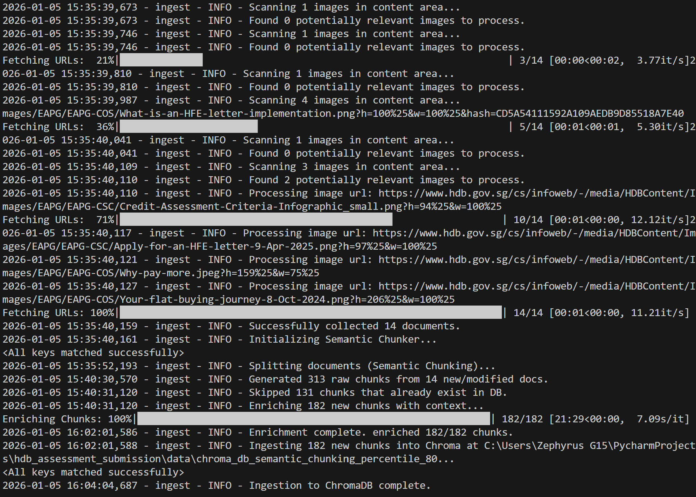

# Housing RAG System

A single-turn Retrieval-Augmented Generation (RAG) system to assist prospective homebuyers with eligibility conditions and loan options.

## Features
- **Document Store**: Ingests, processes, and enriches content from multiple HDB official webpages.
- **Advanced Ingestion**: Implements **Semantic Chunking** and **Context Enrichment** (LLM-generated summaries for each chunk).
- **Robust Retrieval**: Uses a multi-stage retrieval pipeline including **Query Expansion**, **Hybrid Search** (Dense + Sparse), and **Cross-Encoder Reranking**.
- **LLM**: Powered by `Qwen2.5:3b` (running locally via Ollama) for high-quality, efficient inference.
- **Frontend**: Gradio web interface with streaming responses and transparency into retrieved sources.
- **Evaluation**: LLM as a judge and check for answer relevancy and whether any false fact aka hallucination.

## RAG Implementation Strategies
This project implements several useful RAG techniques to ensure we get the relevant answers:

### 1. Data Ingestion & Indexing
- **HTML Parsing**: Custom extraction logic (`BeautifulSoup`) removes noise and preserves data tables by converting them to Markdown.
- **Semantic Chunking**: Instead of fixed-size splitting, `SemanticChunker` is used to split text based on semantic similarity breakpoints, ensuring chunks are thematically coherent.
- **Context Enrichment**: Before indexing, each chunk is passed to an LLM (`Qwen2.5`) to generate a 1-2 sentence "Contextual Summary". This summary is prepended to the chunk, helping the retriever understand the chunk's relevance even if the raw keywords are missing context (e.g., distinguishing "eligibility" for singles vs. families).
- **Vector Store**: Chunks are embedded using `nomic-ai/nomic-embed-text-v1.5` and stored in **ChromaDB**.

### 2. Retrieval Pipeline
The retrieval process is a multi-step pipeline designed to maximize recall and precision:
- **Query Expansion**: The user's query is expanded into 3 alternative/hypothetical questions using the LLM to cover different phrasings and improve recall.
- **Hybrid Search**: Documents are retrieved using an **Ensemble Retriever** (60/40 weight) combining:
    - **Dense Retrieval**: Semantic search via ChromaDB embeddings.
    - **Sparse Retrieval**: Keyword matching via **BM25**.
- **Cross-Encoder Reranking**: The top results from the hybrid search are passed to a Cross-Encoder (`ms-marco-MiniLM-L-6-v2`) which reads the query and document pairs together to output a precise relevance score. The top `N` results are selected for the context window.

### 3. Generation
- **Model**: `Qwen2.5:3b` (via Ollama) generates the final answer based effectively on the reranked context.
- **Streaming**: The system streams the response token-by-token for a better user experience.

## Setup

1. **Clone the repository**:
   ```bash
   git clone <repository_url>
   cd <repository_directory>
   ```

2. **Install dependencies**:
   ```bash
   python -m venv venv
   source venv/bin/activate  # Windows: venv\Scripts\activate
   pip install -r requirements.txt
   ```
   *Note: recommend to use Python 3.13*

3. **Install & Run Ollama**:
   - Download [Ollama](https://ollama.com/).
   - Pull the model:
     ```bash
     ollama pull qwen2.5:3b
     ```

4. **Ingest Data**:
   Crawl the given HDB website, enrich chunks, and populate the vector database:
   ```bash
   python ingest.py --clean 
   ```
   *This process might take a few minutes due to the context enrichment step.*

   

5. **Run the Application**:
   Launch the Gradio interface:
   ```bash
   python app.py
   ```
   Access at `http://localhost:7860`.

   

   

6. **Evaluation**:
   Run the evaluation script:
   ```bash
   python evaluate.py
   ```
   This will save a csv file to your local directory for further analysis. 

## Architecture
- **Framework**: LangChain
- **Vector DB**: ChromaDB
- **Model**: Qwen2.5:3b (Ollama)
- **Embeddings**: nomic-ai/nomic-embed-text-v1.5
- **Reranker**: cross-encoder/ms-marco-MiniLM-L-6-v2

## Project Structure
- `app.py`: Main Gradio application.
- `ingest.py`: Scraping, semantic chunking, context enrichment, and ingestion logic.
- `rag.py`: RAG pipeline module (Retrieval, Expansion, Reranking, Generation).
- `evaluate.py`: Evaluation script using LLM judge.
- `config.py`: Centralized configuration for models, paths, and constants.
